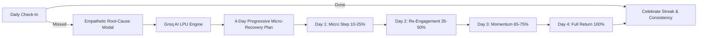
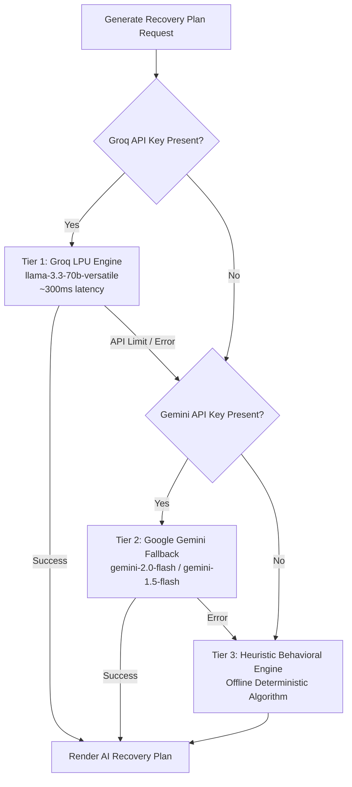

# 🌱 Habit Rescue — Don't Punish the Miss. Rescue the Habit.

> **An empathetic, AI-powered behavioral companion that transforms missed routines into tailored 4-day progressive micro-recovery plans — with zero streak guilt.**

---

## 📌 The Problem & Why Habit Rescue Was Built

### 💥 The Problem: The "All-or-Nothing" Streak Trap
Most habit-tracking applications share an unforgiving and psychologically damaging mechanic: you build a 25-day streak, miss a single day because you caught the flu, worked late on a deadline, or were simply exhausted — and your counter resets to zero.

This punitive design triggers what behavioral psychologists call the **"What-the-Hell Effect"**:
* ❌ **Streak Guilt & Shame**: The user feels like a failure despite 25 days of genuine consistency.
* ❌ **Loss of Momentum**: Resetting to zero removes the psychological incentive to continue (*"I already broke my streak, so why bother trying today?"*).
* ❌ **Habit Abandonment**: Over 80% of habit resolutions are abandoned within 30 days due to this rigid all-or-nothing mindset.

### 🌿 Why This Project Is Important
Human life is inherently variable. True wellness and sustainable habit formation are not about flawless perfection — they are about **resilience and recovery speed**.

Inspired by modern Cognitive Behavioral Therapy (CBT), James Clear's *Atomic Habits* (*"Missing once is an accident. Missing twice is the start of a new habit"*), and Dr. Wendy Wood's habit automaticity research, **Habit Rescue** is built on a fundamental philosophy:

> **A missed habit is not a failure — it is valuable behavioral data.**

When life gets in the way, an app should not punish you; it should adapt to your current energy, diagnose friction, and gently guide you back into rhythm without burnout or guilt.

### 🚀 How Habit Rescue Keeps You Persistent
* 🛡️ **Zero Streak Reset**: Missing a day does not wipe out your hard-earned progress. Instead, your resilience is recorded and celebrated.
* 🧠 **Empathetic Root-Cause Diagnosis**: When you miss a habit, Habit Rescue simply asks: *"What got in the way today?"* (e.g., *Too tired, No time, Felt resistant, Schedule shift*).
* ⚡ **4-Day Progressive AI Micro-Recovery**: Powered by **Groq LPU AI** (`llama-3.3-70b-versatile`), the app generates an instant 4-day ramp-up plan. Day 1 starts with an effortless micro-step (10–25% duration, e.g., 5 minutes or a light walk) to keep the neural habit loop active, ramping progressively back to 100% by Day 4.
* 📈 **Root-Cause Pattern Detection**: Uncovers hidden weekly obstacles (e.g., *"You miss workouts on Thursdays 70% of the time due to fatigue"*) and provides actionable friction-reduction tweaks before failure occurs.

---

## 🎯 Track Submissions

* **Main Track**: 🌿 **Wellness Track**  
  *Directly supports mental and behavioral wellness by eliminating habit anxiety, shame, and burnout. Replaces punishment with self-compassion, cognitive reframing, and sustainable personal growth.*

* **Bonus Track**: 🤖 **Best Use of AI**  
  *Embedded as an intelligent behavioral habit psychologist rather than a generic chatbot. Dynamically crafts stepped, low-friction micro-plans in sub-seconds using Groq LPUs, evaluates pattern diagnostics, and generates personalized weekly behavioral reviews.*

---

## 💡 Key Features & Capabilities



### 1. 📊 Interactive Dashboard & Resilient Metrics
* **Live Consistency Gauge**: Measures overall lifetime adherence instead of fragile consecutive-day streaks.
* **Today's Completion Ratio**: Instant snapshot of daily routines completed, pending, or in recovery.
* **Dual Action Habit Rows**: Clear **Mark as Done** and **Missed** action triggers for seamless daily tracking.
* **Today's Rescue Banner**: Real-time overview of active recovery micro-steps awaiting completion today.

### 2. 🤖 4-Day Progressive AI Micro-Recovery Plans
* **Day 1 (Micro-Step, 10–25%)**: Zero activation barrier to re-establish psychological momentum without friction.
* **Day 2 (Re-Engagement, 35–50%)**: Gentle escalation focusing on presence over intensity.
* **Day 3 (Momentum Builder, 65–75%)**: Smooth ramp-up strengthening the behavioral routine.
* **Day 4 (Full Recovery, 100%)**: Return to your regular standard target feeling accomplished.

### 3. 🛟 Dedicated AI Rescue Center
* **Paced Daily Unlocking**: Recovery steps unlock one day at a time to prevent bingeing, overexertion, and relapse.
* **Dynamic Plan Variations**: One-click **"Generate Another Plan"** with tailored behavioral angles (*Micro-routines, Habit Stacking, Friction Removal*).
* **Next-Day Re-proposal**: Intelligently offers fresh recovery strategies if a previous plan was cancelled or interrupted.
* **Seamless Auto-Resolution**: When a habit is marked complete normally, any active recovery plan automatically completes.

### 4. 🔍 Obstacle Pattern Recognition & Analytics
* **Root-Cause Analysis**: Correlates missed days with specific failure reasons (*Fatigue, Schedule Changes, Low Motivation*).
* **Day-of-Week Friction Mapping**: Identifies high-risk days (e.g., recurring Thursday drop-offs) and recommends pre-emptive habit touchpoints.

### 5. 📅 Non-Punitive Monthly Calendar Journal
* Visual monthly overview celebrating both standard completions and resilient AI rescue completions.
* Filters by specific habit or view across all routines simultaneously.

### 6. 📝 AI Weekly Behavioral Review
* Summary of completion rates, primary obstacles, and successfully rescued routines.
* Custom actionable recommendations generated by AI to optimize your environment for the upcoming week.

### 7. 🌓 Dual Zen Botanical Theme System
* Crafted with a warm Zen Botanical palette (Sage Emerald `#659F84`, Terracotta `#E07A5F`, Sand Gold `#E9C46A`, and Obsidian `#141917`).
* Full **Light Mode & Dark Mode** support with high-contrast typography and accessible elements.

---

## 🛠️ Technologies & Architecture

```
HabitRescue/
├── src/
│   ├── components/
│   │   ├── auth/          # Firebase Login, Signup, & One-Click Demo
│   │   ├── common/        # Navbar, Footer, ThemeToggle, Toast Notifications
│   │   ├── dashboard/     # CompactHabitRow, WeeklyBarChart, ConsistencyMeter
│   │   ├── habits/        # HabitCard, HabitFormModal, MissedHabitModal
│   │   ├── landing/       # Clinical Research Foundation, Comparison Cards, Hero
│   │   ├── rescue/        # RescueCard, StepPill, ActionableRescuePlan
│   │   └── review/        # WeeklyReviewCard, PatternInsightCard
│   ├── context/
│   │   ├── AuthContext.jsx   # Firebase Auth & Demo state management
│   │   ├── HabitContext.jsx  # Real-time Firestore sync & CRUD logic
│   │   └── ThemeContext.jsx  # Light/Dark mode state with persistence
│   ├── firebase/
│   │   └── config.js         # Firebase App, Auth, & Firestore setup
│   ├── pages/             # Dashboard, My Habits, Rescue Center, Weekly Review, Calendar
│   ├── services/
│   │   └── aiEngine.js       # Groq API, Gemini fallback, Heuristic Engine & Pattern Diagnostics
│   ├── App.jsx            # Protected routes & App navigation layout
│   └── main.jsx           # Application entry point
├── public/                # Static assets & icons
├── .env.example           # Environment variables template
├── tailwind.config.js     # Custom Zen Botanical color themes & fonts
└── vite.config.js         # Vite configuration with envPrefix support
```

### Frontend & UI
* **React 18**: Modular component-based architecture with custom hooks.
* **Vite**: Sub-millisecond HMR and optimized production bundling.
* **Tailwind CSS**: Custom color tokens, glassmorphism, responsive utilities, and dark-mode classes.
* **Lucide React**: Clean iconography across all UI elements.
* **Recharts**: Interactive visual charts for weekly performance and habit consistency.
* **Date-fns**: Lightweight, robust date calculations and calendar grids.

### Backend & Cloud Persistence
* **Firebase Authentication**: Email/Password authentication, secure password resets, and instant one-click guest demo sessions.
* **Cloud Firestore**: Real-time cloud database syncing habits, daily log history, and active rescue plans across multiple devices.

---

## 🧠 AI Engine & Multi-Tier Fallback Pipeline

Habit Rescue utilizes a **3-tier resilient AI architecture** ensuring 100% uptime, zero user waiting time, and completely offline capabilities:



| Tier | Engine / Provider | Models Used | Latency | Purpose |
| :--- | :--- | :--- | :--- | :--- |
| **Tier 1 (Primary)** | **Groq Cloud API** | `llama-3.3-70b-versatile`<br>`llama-3.1-8b-instant` | **~300ms** | Ultra-fast LPU inference delivering intelligent, empathetic behavioral psychologist plans with structured JSON schemas. |
| **Tier 2 (Fallback)** | **Google Gemini API** | `gemini-2.0-flash`<br>`gemini-1.5-flash` | **~1.2s** | Cloud fallback ensuring high-quality reasoning if primary API constraints occur. |
| **Tier 3 (Offline)** | **Heuristic Engine** | Deterministic Behavioral Algorithm | **< 5ms** | 100% offline uptime guarantee calculating stepped micro-goals and unique variation strategies locally. |

---

## 🔑 API Keys & Environment Variables Configuration

The application requires environment variables for Firebase services and AI engines. Create a `.env` file in the root directory:

```env
# ==========================================
# 🌿 FIREBASE CONFIGURATION (Auth & Database)
# ==========================================
VITE_FIREBASE_API_KEY=your_firebase_api_key
VITE_FIREBASE_AUTH_DOMAIN=your_project_id.firebaseapp.com
VITE_FIREBASE_PROJECT_ID=your_project_id
VITE_FIREBASE_STORAGE_BUCKET=your_project_id.firebasestorage.app
VITE_FIREBASE_MESSAGING_SENDER_ID=your_messaging_sender_id
VITE_FIREBASE_APP_ID=your_app_id
VITE_FIREBASE_MEASUREMENT_ID=your_measurement_id

# ==========================================
# ⚡ AI INFERENCE ENGINES
# ==========================================
# Primary AI Engine (Groq Cloud API - Llama 3.3 70B Versatile)
VITE_GROQ_API_KEY=gsk_your_groq_api_key_here

# Secondary AI Fallback (Google Gemini API - Gemini 2.0 Flash)
VITE_GEMINI_API_KEY=your_gemini_api_key_here
```

### Where to Obtain Your Free API Keys:
1. **Groq Cloud API Key**: Get a free, lightning-fast key from [console.groq.com](https://console.groq.com/).
2. **Google Gemini API Key**: Get a free API key from [aistudio.google.com](https://aistudio.google.com/).
3. **Firebase Credentials**: Create a project in [console.firebase.google.com](https://console.firebase.google.com/), enable **Authentication** (Email/Password) and **Cloud Firestore Database**.

---

## 🚀 Getting Started Locally

### Prerequisites
* **Node.js**: v18.0.0 or higher
* **npm** or **yarn**

### Step-by-Step Installation

1. **Clone the Repository**:
   ```bash
   git clone https://github.com/Kiran-F/Habit-Rescue.git
   cd HabitRescue
   ```

2. **Install Dependencies**:
   ```bash
   npm install
   ```

3. **Set Up Environment Variables**:
   ```bash
   cp .env.example .env
   ```
   *Open `.env` and fill in your Firebase and Groq API keys.*

4. **Run the Development Server**:
   ```bash
   npm run dev
   ```
   *Open [http://localhost:3000](http://localhost:3000) in your browser.*

5. **Build for Production**:
   ```bash
   npm run build
   ```

---

## 👥 Built with Care

Built for anyone striving to build sustainable, lifelong habits without the pressure of perfection.  
**Don't punish the miss. Rescue the habit.** 🌱
